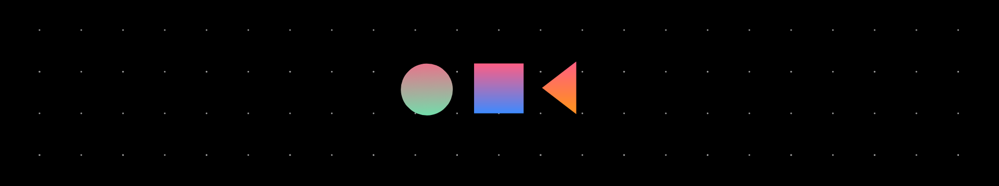

## Who am I?

I am a creative technologist who is passionate about the Internet of Things ( IoT ). I believe that there is nothing greater than working on something that you enjoy, which makes you create awesome things.

Till now, I have worked on different layers of IoT Stack ( Device Hardware | Device Software | Communications | Cloud Platforms | Cloud Applications ) and developed IoT solutions in the areas of Smart Home, Smart Mobility, and Smart Infrastructure. I continue to explore new topics and technologies in the exciting area of the Internet of Things. 

My other areas of interest include Software Architecture patterns, Agile methodologies, Clean Code principles, Design Thinking, User Experience Design, Artificial Intelligence, and Blockchain.

When I am not working, I am usually with a sheet of paper and a bunch of pencils sketching some stuff. I am a creative person who loves logo designing and graphics creation. I travel and take photographs whenever I can.

My mantra: "An engineer should know everything about something and something about everything"

## I’m currently working on

### Sudoc
Developing my personal tech blog with focus on IoT, self-designed and built using NextJS and Strapi

### Smart Infrasturcture and Smart Grids
Working on the research projects in the aforementioned area at Siemens

## What I have worked on

### Smart Mobility
Worked with Bosch Engineering to build Calponia, a cloud-based platform with the goal to simplify and automate complex development processes.
Worked on providing connectivity services for IoT devices that are using Calponia.

Professional github profile: [sudobhat](https://github.com/sudobhat)

## Skills

As an IoT enthusiast, I would like to list my skills by different layers of the Internet of Things.

1) Device Hardware:
 • Raspberry Pi, BeagleBone Black, Arduino, Particle Photon, ESP8266, ESP32 Node MCU, PSoC 5LP, etc.,
 • 16/32 bit RISC Architectures, ARM Cortex M Series from Atmel, Altera, Atmega, Spansion, STM
 • Interfacing various sensors and peripherals
 • HIL Testing
 
2) Device Software:
 • C, C++, Embedded C, Python, Shell Script
 • Operating systems like Linux, Embedded Linux, FreeRTOS, Mongoose OS, and OSEK
 • Eclipse, Borland Together, CPPUnit, Microsoft Visual Studio, Atmel Studio

3) Communications:
 • TCP/IP, MQTT, AMQP, CAN, UART, SPI, I2C, Zigbee, BLE, NFC, GSM, and 1 wire

4) Cloud Platform:
 • Could Service like AWS IAM, AWS IoT Core, AWS Lambda, AWS S3, AWS EC2, AWS ECS, AWS API Gateway, AWS SNS, Azure IoT Hub, Google Cloud IoT
 • Containerization and Orchestration using Docker, Kubernetes, Kops, AWS EKS, Terraform. 
 • Analysis and Visualization of data using Elastic Cloud. 
 • WebVR ( A-Frame ), Node-RED, OpenHAB, Home Assistant

5) Cloud Applications:
 • HTML, CSS, Javascript, Typescript, MERN Stack ( MongoDb, ExpressJS, ReactJS, NodeJS ), Tailwind CSS, Storybook, Frameworks like NextJS
 • Working with SQL and NoSQL databases ( PostgreSQL, MongoDB )
 • Jest, Mocha, Chai, Sinon, Test Driven Development (TDD), End-to-End testing using Cypress

Other skills: 
 • User Experience ( UX ) and Design Thinking, Software Architecture ( Attribute Driven Design ), Microservices Architecture, Agile ( Scrum ), and V Model Development, UML.
 • Git, Virtual Box, Microsoft Office, JIRA. 

## I constantly write IoT related content on my blog 

Check out [sudoc.dev](https://sudoc.dev) !

## How to reach me

[Twitter](https://www.twitter.com/sudobhat)

[Instagram](https://www.instagram.com/le_sudarshan)

[LinkedIn](https://www.linkedin.com/in/sudarshangbhat)

